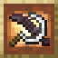
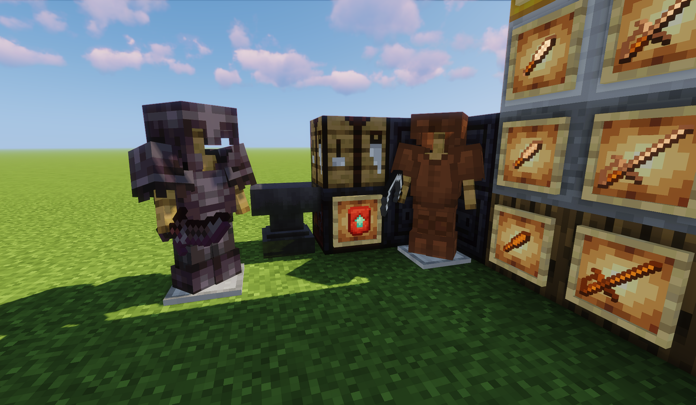
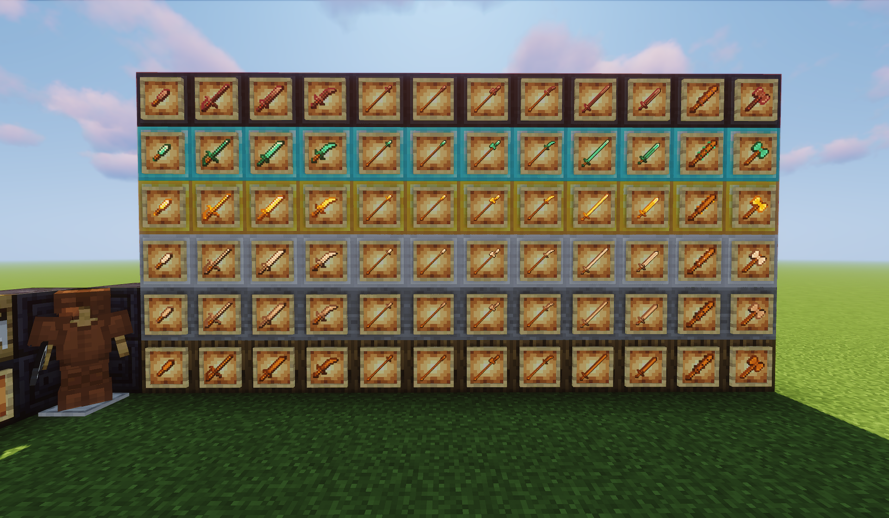
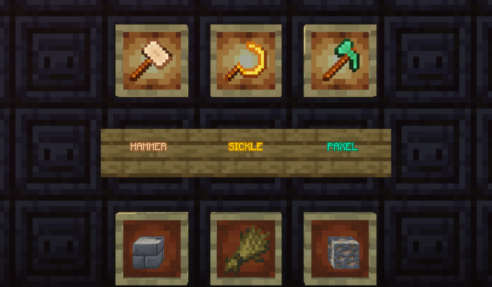
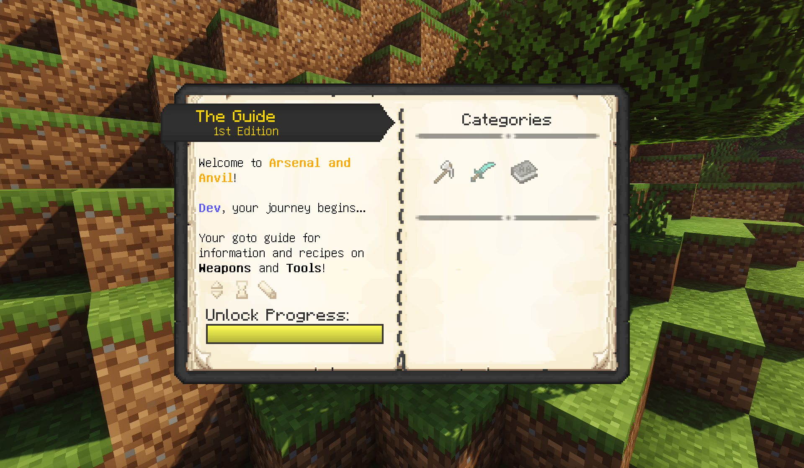
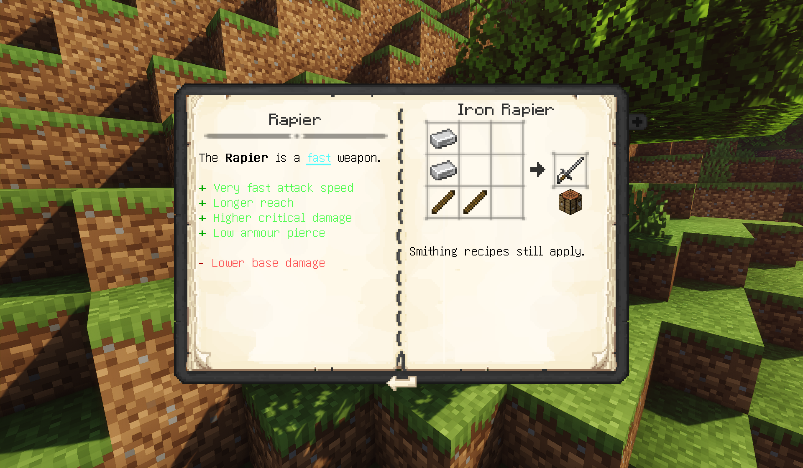

<p align="center"></p>

<h1 align="center">Arsenal and Anvil <br>
    <a href="https://github.com/junyali/arsenalandanvil/actions/workflows/build.yml"></a>
    <a href="https://github.com/junyali/arsenalandanvil/releases/"></a>
    <a href="https://github.com/junyali/arsenalandanvil/blob/main/LICENSE"></a>
    <br>
    <a href="https://www.curseforge.com/minecraft/mc-mods/arsenal-and-anvil"></a>
    <a href="https://modrinth.com/mod/arsenal-and-anvil"></a>
    <a href="https://ko-fi.com/junyali"></a>
    <br><br>
</h1>

<p>Arsenal and Anvil is a small QoL mod aimed to add a variety of new weapons and tools for all tiers!</p>
<p>All items can be crafted like you normally would in vanilla (with the usage of a different crafting component in substitution of the stick), with a helpful guide to start you off!</p>

<h2 align="center">Gallery <br><br>
    
    
    
    
    
    <br>
</h2>

<h2 align="center">How to run / build <br></h2>
<h3>Requirements</h3>
<p><b>NeoForge: </b>This mod was built on NeoForge version 21.1.173 for 1.21.1</p>
<h4>Dependencies</h4>
<ul>
<li>Apothic Attributes 2.8.1 or later</li>
<a href="https://www.curseforge.com/minecraft/mc-mods/apothic-attributes/files/6514649"></a>
<li>Placebo 9.8.1 or later</li>
<a href="https://www.curseforge.com/minecraft/mc-mods/placebo/files/6446766"></a>
<li>Curios 9.5.1 or later</li>
<a href="https://www.curseforge.com/minecraft/mc-mods/curios/files/6529130"></a>
<li>Patchouli 1.21-88 or later</li>
<a href="https://www.curseforge.com/minecraft/mc-mods/patchouli/files/6164617"></a>
</ul>
<h3>Running</h3>
<p>Download the latest release <a href="https://github.com/junyali/arsenalandanvil/releases">here</a>.</p>
<h3>Building</h3>
<p>This mod was developed on IntelliJ IDEA Ultimate, though may work with other Java IDEs that support the Gradle Build Tool</p>
<p>Importing from `build.gradle`, run:</p>

```console
$ ./gradlew
```
